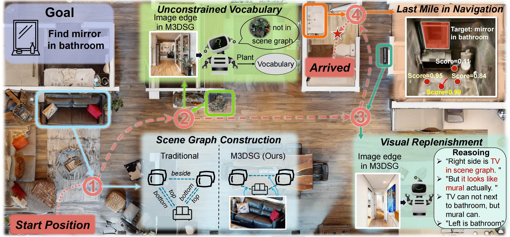

# MSGNav: Unleashing the Power of Multi-modal 3D Scene Graph for Zero-Shot Embodied Navigation

  

## 📰 News
- [Coming Soon] 🤖 Deployment code for Unitree G1 will be released.
- [Mar 4, 2026] 🚀 Code is released.
- [Feb 21, 2026] 🎉 MSGNav is accepted to CVPR 2026.
