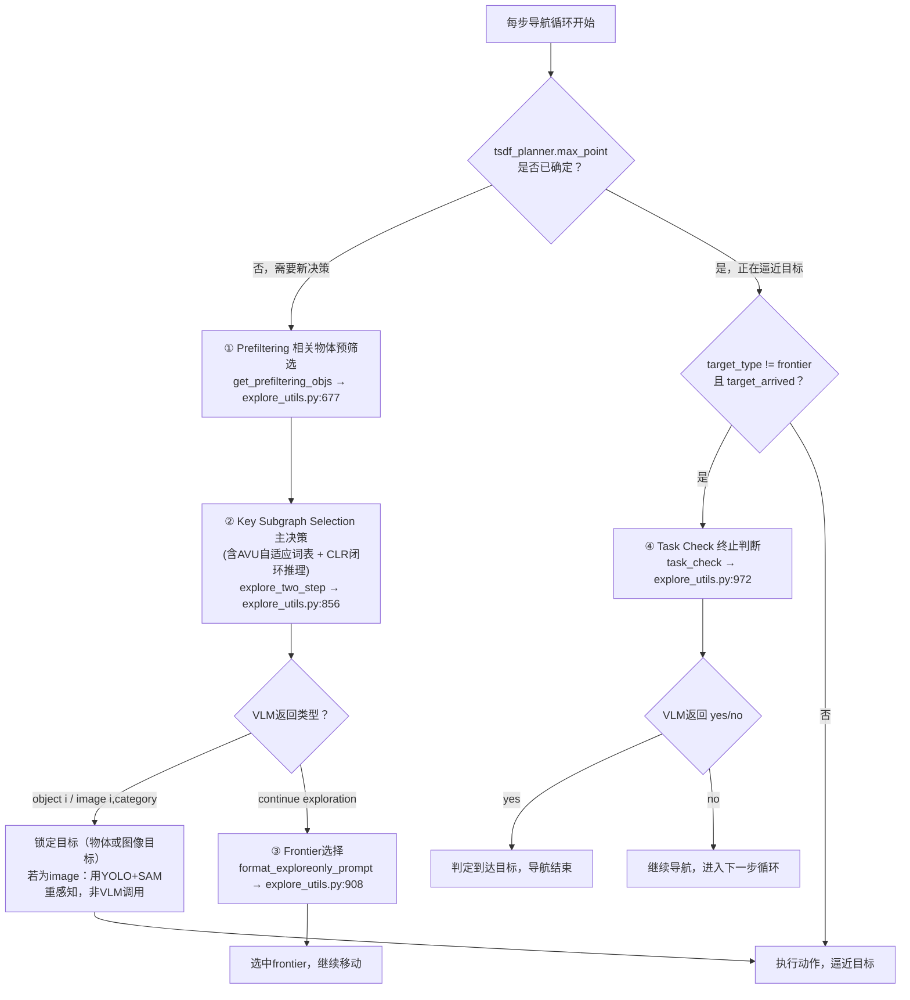

# MSGNav：Object Mapping 与 Scene Graph（M3DSG）构建流程图

依据代码走查（`src/multimodal_3d_scene_graph.py`、`src/conceptgraph/slam/*`、`src/explore_utils.py`）绘制，每帧执行一次，入口为 `Scene.update_scene_graph()`（`src/multimodal_3d_scene_graph.py:310-618`）。

## 一、Object Mapping 流程图

```mermaid
flowchart TD
    A["输入：RGB图 + 深度图 + 相机内参K + 相机位姿pose"] --> B["房间分类（可选）\nCLIP整图特征 vs 房间名文本特征\n→ room_label, room_conf"]
    B --> C["2D检测：YOLO-World\npredict(image_rgb, conf=0.1)\n→ xyxy(N,4), confidence, class_id"]
    C --> D["分割：SAM（以2D box为prompt）\n→ masks(N,H,W) 二值mask"]
    D --> E["打包为 Detections\n(xyxy, confidence, class_id, mask)"]
    E --> F["过滤 filter_detections\nNMS / IoU / 置信度 / mask尺寸阈值"]
    F --> G["逐检测框裁剪RGB(+20px padding)\nCLIP编码 → image_feats（视觉embedding）\n同时保留 image_crops, text_feats"]
    G --> H["resize_gobs 对齐分辨率\n→ filter_gobs 去除过小/背景类/低置信度mask"]
    H --> I["mask_subtract_contained\n剔除被大mask完全包含的小mask（如沙发上的抱枕单独成实例）"]
    I --> J["3D反投影 detections_to_obj_pcd_and_bbox\n深度+内参 → 相机系3D点\n按pose变换到世界系 → 每物体点云"]
    J --> K["get_bounding_box\n计算3D bbox（OrientedBoundingBox/AABB）"]
    K --> L["init_process_pcd\n体素降采样 + DBSCAN去噪"]
    L --> M["距离过滤 filter_gobs_with_distance\n丢弃距agent超过 obj_include_dist 的物体"]
    M --> N["组装物体字典\nmake_detection_list_from_pcd_and_gobs\n{id, class_name, class_id, conf, pcd, bbox,\n clip_ft, image_path, room_label,...}"]
    N --> O{"地图中已有物体？"}
    O -- 否 --> P["全部作为新物体加入 self.objects"]
    O -- 是 --> Q["空间相似度 compute_spatial_similarities\n3D IoU/GIoU 或点云重叠率"]
    Q --> R["视觉相似度 compute_visual_similarities\nCLIP embedding 余弦相似度"]
    R --> S["聚合 aggregate_similarities\nsim=(1+phys_bias)*spatial_sim+(1-phys_bias)*visual_sim"]
    S --> T{"argmax(sim) ≥ sim_threshold？"}
    T -- 是（匹配成功） --> U["合并 merge_obj2_into_obj1\n点云拼接+降噪，bbox重算，\nclass_id/image_path_list累加，\nclip_ft/conf更新，class_name多数投票重定"]
    T -- 否（未匹配） --> P
    U --> V["更新 self.objects"]
    P --> V
    V --> W["周期性全局维护 periodic_cleanup_objects\ndenoise_objects → filter_objects（点数/检测次数不足则删除）\n→ merge_objects（点云重叠+CLIP相似度+类名相似度阈值合并）"]
    W --> X["输出：持久化物体地图 self.objects\n(id → {pcd, bbox, clip_ft, class_name, image_path_list,...})"]
```



**关键判据小结**：
- 2D→3D：深度反投影 + 相机位姿变换（非单目估计）
- 实例匹配融合判据：`spatial_sim（3D IoU/点云重叠）` + `visual_sim（CLIP余弦相似度）` 加权和 ≥ `sim_threshold`
- 全局重合并判据：点云重叠率 > `merge_overlap_thresh`，且 CLIP相似度 > `merge_visual_sim_thresh`、类名相似度 > `merge_text_sim_thresh`

---

## 二、Scene Graph（M3DSG）构建流程图（含边构建标准）

```mermaid
flowchart TD
    A["当前帧物体更新完成\nframe_obj_ids = 本帧所有检测到/匹配到的物体id"] --> B["Scene.update_scene_graph_edges()\n对 frame_obj_ids 做两两组合"]
    B --> C{"两物体3D bbox中心距离\n< edge_dist_threshold ？"}
    C -- 否 --> D["不建边，跳过该物体对"]
    C -- 是（满足共现空间邻近判据） --> E{"边 (obj1_idx, obj2_idx)\n是否已存在于 self.edges？"}
    E -- 不存在 --> F["新建 MapEdge\n{obj1_idx, obj2_idx,\n rel_img=[当前帧图像文件名],\n num_detections=1,\n first_detected=当前step}"]
    E -- 已存在 --> G["更新已有边\nrel_img.append(当前帧图像文件名)\nnum_detections += 1"]
    F --> H["同步更新反向索引\nimg_to_edge[img_path].append((obj1,obj2))"]
    G --> H
    H --> I["输出：self.edges\n(obj1,obj2) → MapEdge{rel_img: 该关系被观测到的\n所有原始RGB帧文件名列表}"]
    A --> J["del_unused_scene_graph_edges\n清理端点物体已被filter_objects/merge_objects\n删除的失效边"]
    I --> K["【查询时】Key Subgraph Selection\n先按任务目标筛选相关物体子集"]
    K --> L["edge_pruning_KSS：贪心加权集合覆盖\n对候选边的rel_img列表建最大堆\n(堆键=gain=该图像能覆盖的未覆盖边数量)"]
    L --> M{"每轮选gain最大的图像\n直到所有候选边被覆盖\n或堆耗尽"}
    M --> N["动态挑选出的最小图像集合\nprocessed_images（base64编码后送入VLM）"]
    N --> O["VLM Prompt 渲染关系\n\"obj1, obj2, [Image i, Image j...]\"\nVLM直接看真实照片推理物体间关系，\n而非读取固定文本关系标签"]
```

**建边核心标准**：
1. **共现判据**：同一帧内被同时检测/匹配到（`frame_obj_ids` 同时包含两者）
2. **空间邻近判据**：两物体 3D bbox 中心欧氏距离 `< edge_dist_threshold`（唯一的建边阈值，无需类别/语义约束）
3. **边不存文本，存图像**：`rel_img` 只是不断累积「该关系被观测到的原始 RGB 帧文件名」，无固定文本关系标签（legacy 的 `update_scene_graph_edges_concept` 会调用 LLM 生成文本 caption，但主流程未启用）
4. **动态分配 = 查询期的图像选择**：并非每条边固定绑定一张图，而是在 KSS 阶段用贪心加权集合覆盖算法，从 `rel_img` 候选池中挑选覆盖所有待展示关系所需的最少图像集合，再喂给 VLM——这是论文中"动态分配图像"的真正含义
5. **边的失效清理**：`del_unused_scene_graph_edges` 会在物体因全局去噪/合并被移除后，同步清理挂在其上的边

---

## 三、导航流程中的VLM调用点梳理

MSGNav 每一步导航决策会**分阶段轮流调用同一个VLM（GPT-4o 或 Qwen-VL-Max，`src/const.py:7` `API_MODE` 切换）**，而不是一次调用产出所有结果。所有请求最终都经过统一入口 `call_openai_api`（`src/explore_utils.py:75`），返回纯文本，由不同上层函数各自解析。**场景图边的构建本身不调用VLM**（见上文，纯几何+CLIP规则），VLM只在推理阶段被动读取边及其引用图像。



### 各VLM调用点的输入/输出

| 步骤 | 调用函数 / 位置 | 输入 | 输出 |
|---|---|---|---|
| **① Prefiltering**<br>相关物体预筛选 | `get_prefiltering_objs`<br>`explore_utils.py:677`（KSS第一子步骤） | 无图像（image-goal任务时附1张目标图）；文本＝完整物体列表（每个物体的id/class_name/room_label/邻接物体id）+ 任务question | 纯文本，每行一个物体id → 解析为`selected_objs`（top_k个候选物体id列表），供下一步构建关键子图 |
| **② Key Subgraph Selection 主决策**（含AVU词表更新+CLR闭环推理） | `explore_two_step`<br>`explore_utils.py:856`，prompt由`Prompt_with_AVU_and_CLR`(`:207`)或`Prompt_without_AVU`(`:354`)构造 | 图像：KSS贪心集合覆盖选出的关系关键帧（`edge_pruning_KSS`产出）+ 当前自我中心视图(egocentric_views)，数量=processed_images数+egocentric_imgs数；文本：question(+可选目标图)、候选物体属性(id/name/坐标/room_label)、关系属性(边+引用图像编号)、CLR历史决策（此前每步选过的object/image/frontier及是否失败） | 纯文本两行：第一行`"object i"` / `"image i, category"` / `"continue exploration"`；第二行reasoning。若为"image"，`i`为图像编号、`category`为AVU待识别目标类别词 |
| **③ Frontier选择**（仅当②返回continue exploration时触发） | `format_exploreonly_prompt`(`:495`) + 调用于`explore_utils.py:908`（`explore_two_step`内层循环） | 图像：所有frontier对应的视图特征；文本：question(+目标图) | 纯文本`"frontier i"`+reason，i为选中frontier下标 |
| **④ Task Check 终止判断** | `task_check`<br>`explore_utils.py:945`，调用于`:972`，由`query_vlm_for_response_end`(`query_vlm.py:325`)触发 | 图像：最近`cfg.frames_to_check`步的自我中心观测帧（按step分组）；文本：question(+目标图)，**不含**场景图/物体/边信息 | 纯文本`"yes"`/`"no"`+reason。yes→判定已到达目标、终止导航；no→继续下一步循环 |

### 关键说明
- **①②③是同一次决策流程内按需触发的最多3类独立VLM请求**，不是一次调用返回多个字段——若②已选中object/image目标，则不再触发③；只有②判定"continue exploration"才会调用③。
- **场景图关系(边)没有独立的VLM推理步骤**：边由建图阶段的空间邻近规则生成（见上文"二、Scene Graph构建流程图"），VLM仅在②中读取边列表+引用图像做被动推理，不为"判断A和B关系"单独发起请求。
- **房间分类不算VLM调用**：`room_label`/`room_conf`由CLIP相似度比对得到（`multimodal_3d_scene_graph.py:331-344`），只是作为文本字段传入②的prompt供VLM参考。
- 图像来源始终是真实观测帧（当前自我中心视图 或 历史关键帧/边引用图像），没有渲染或合成图像。
