# MSGNav：Object Mapping 与 Scene Graph（M3DSG）构建流程图

依据代码走查（`src/multimodal_3d_scene_graph.py`、`src/conceptgraph/slam/*`、`src/explore_utils.py`）绘制，每帧执行一次，入口为 `Scene.update_scene_graph()`（`src/multimodal_3d_scene_graph.py:310-618`）。

## 一、Object Mapping 流程图

```mermaid
flowchart TD
    A["输入：RGB图 + 深度图 + 相机内参K + 相机位姿pose"] --> B["房间分类（可选）\nCLIP整图特征 vs 房间名文本特征\n→ room_label, room_conf"]
    B --> C["2D检测：YOLO-World\npredict(image_rgb, conf=0.1)\n→ xyxy(N,4), confidence, class_id"]
    C --> D["分割：SAM（以2D box为prompt）\n→ masks(N,H,W) 二值mask"]
    D --> E["打包为 Detections\n(xyxy, confidence, class_id, mask)"]
    E --> F["过滤 filter_detections\nNMS / IoU / 置信度 / mask尺寸阈值"]
    F --> G["逐检测框裁剪RGB(+20px padding)\nCLIP编码 → image_feats（视觉embedding）\n同时保留 image_crops, text_feats"]
    G --> H["resize_gobs 对齐分辨率\n→ filter_gobs 去除过小/背景类/低置信度mask"]
    H --> I["mask_subtract_contained\n剔除被大mask完全包含的小mask（如沙发上的抱枕单独成实例）"]
    I --> J["3D反投影 detections_to_obj_pcd_and_bbox\n深度+内参 → 相机系3D点\n按pose变换到世界系 → 每物体点云"]
    J --> K["get_bounding_box\n计算3D bbox（OrientedBoundingBox/AABB）"]
    K --> L["init_process_pcd\n体素降采样 + DBSCAN去噪"]
    L --> M["距离过滤 filter_gobs_with_distance\n丢弃距agent超过 obj_include_dist 的物体"]
    M --> N["组装物体字典\nmake_detection_list_from_pcd_and_gobs\n{id, class_name, class_id, conf, pcd, bbox,\n clip_ft, image_path, room_label,...}"]
    N --> O{"地图中已有物体？"}
    O -- 否 --> P["全部作为新物体加入 self.objects"]
    O -- 是 --> Q["空间相似度 compute_spatial_similarities\n3D IoU/GIoU 或点云重叠率"]
    Q --> R["视觉相似度 compute_visual_similarities\nCLIP embedding 余弦相似度"]
    R --> S["聚合 aggregate_similarities\nsim=(1+phys_bias)*spatial_sim+(1-phys_bias)*visual_sim"]
    S --> T{"argmax(sim) ≥ sim_threshold？"}
    T -- 是（匹配成功） --> U["合并 merge_obj2_into_obj1\n点云拼接+降噪，bbox重算，\nclass_id/image_path_list累加，\nclip_ft/conf更新，class_name多数投票重定"]
    T -- 否（未匹配） --> P
    U --> V["更新 self.objects"]
    P --> V
    V --> W["周期性全局维护 periodic_cleanup_objects\ndenoise_objects → filter_objects（点数/检测次数不足则删除）\n→ merge_objects（点云重叠+CLIP相似度+类名相似度阈值合并）"]
    W --> X["输出：持久化物体地图 self.objects\n(id → {pcd, bbox, clip_ft, class_name, image_path_list,...})"]
```



**关键判据小结**：
- 2D→3D：深度反投影 + 相机位姿变换（非单目估计）
- 实例匹配融合判据：`spatial_sim（3D IoU/点云重叠）` + `visual_sim（CLIP余弦相似度）` 加权和 ≥ `sim_threshold`
- 全局重合并判据：点云重叠率 > `merge_overlap_thresh`，且 CLIP相似度 > `merge_visual_sim_thresh`、类名相似度 > `merge_text_sim_thresh`

---

## 二、Scene Graph（M3DSG）构建流程图（含边构建标准）

```mermaid
flowchart TD
    A["当前帧物体更新完成\nframe_obj_ids = 本帧所有检测到/匹配到的物体id"] --> B["Scene.update_scene_graph_edges()\n对 frame_obj_ids 做两两组合"]
    B --> C{"两物体3D bbox中心距离\n< edge_dist_threshold ？"}
    C -- 否 --> D["不建边，跳过该物体对"]
    C -- 是（满足共现空间邻近判据） --> E{"边 (obj1_idx, obj2_idx)\n是否已存在于 self.edges？"}
    E -- 不存在 --> F["新建 MapEdge\n{obj1_idx, obj2_idx,\n rel_img=[当前帧图像文件名],\n num_detections=1,\n first_detected=当前step}"]
    E -- 已存在 --> G["更新已有边\nrel_img.append(当前帧图像文件名)\nnum_detections += 1"]
    F --> H["同步更新反向索引\nimg_to_edge[img_path].append((obj1,obj2))"]
    G --> H
    H --> I["输出：self.edges\n(obj1,obj2) → MapEdge{rel_img: 该关系被观测到的\n所有原始RGB帧文件名列表}"]
    A --> J["del_unused_scene_graph_edges\n清理端点物体已被filter_objects/merge_objects\n删除的失效边"]
    I --> K["【查询时】Key Subgraph Selection\n先按任务目标筛选相关物体子集"]
    K --> L["edge_pruning_KSS：贪心加权集合覆盖\n对候选边的rel_img列表建最大堆\n(堆键=gain=该图像能覆盖的未覆盖边数量)"]
    L --> M{"每轮选gain最大的图像\n直到所有候选边被覆盖\n或堆耗尽"}
    M --> N["动态挑选出的最小图像集合\nprocessed_images（base64编码后送入VLM）"]
    N --> O["VLM Prompt 渲染关系\n\"obj1, obj2, [Image i, Image j...]\"\nVLM直接看真实照片推理物体间关系，\n而非读取固定文本关系标签"]
```

**建边核心标准**：
1. **共现判据**：同一帧内被同时检测/匹配到（`frame_obj_ids` 同时包含两者）
2. **空间邻近判据**：两物体 3D bbox 中心欧氏距离 `< edge_dist_threshold`（唯一的建边阈值，无需类别/语义约束）
3. **边不存文本，存图像**：`rel_img` 只是不断累积「该关系被观测到的原始 RGB 帧文件名」，无固定文本关系标签（legacy 的 `update_scene_graph_edges_concept` 会调用 LLM 生成文本 caption，但主流程未启用）
4. **动态分配 = 查询期的图像选择**：并非每条边固定绑定一张图，而是在 KSS 阶段用贪心加权集合覆盖算法，从 `rel_img` 候选池中挑选覆盖所有待展示关系所需的最少图像集合，再喂给 VLM——这是论文中"动态分配图像"的真正含义
5. **边的失效清理**：`del_unused_scene_graph_edges` 会在物体因全局去噪/合并被移除后，同步清理挂在其上的边
